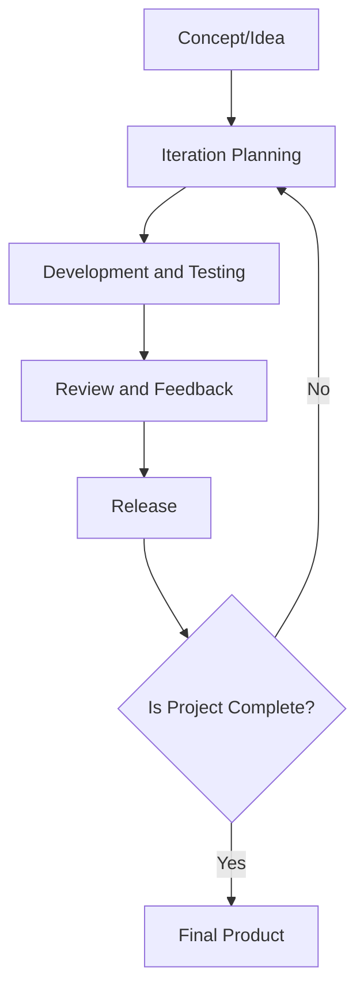

# Introduction to Software Engineering

Software engineering is the application of engineering principles to design, develop, maintain, test, and evaluate software to ensure it is efficient, reliable, scalable, and cost-effective.

- **Why Software Engineering?**  
  It ensures high-quality software that meets user requirements while reducing risks and managing complexity.

---

## 1. Software Process
The **software process** refers to the systematic approach followed to develop software from the initial idea to the final deployment and maintenance. It consists of **phases**, such as:

1. **Requirements Gathering**: Understanding what the client wants.  
   *Example*: E-commerce website needing features like product search, shopping cart, and payment gateway.
   
2. **Design**: Creating a blueprint of the system, including architecture and UI.  
   *Example*: A designer creates wireframes for an online food delivery app.

3. **Implementation**: Coding the software.  
   *Example*: Developers write code in React (frontend) and Java (backend).

4. **Testing**: Ensuring the software works as expected.  
   *Example*: QA team checks if a payment gateway handles failed transactions correctly.

5. **Deployment**: Releasing the software to users.  
   *Example*: Launching a mobile app on the Play Store or App Store.

6. **Maintenance**: Fixing bugs, updating features, or improving performance.  
   *Example*: Netflix releasing updates to add new features or fix streaming issues.

---

## 2. Software Process Model
A **software process model** provides a framework to structure and manage software development. Popular models include:

### (a) **Waterfall Model**
- Linear and sequential process where each phase depends on the previous one.  
  *Example*: Building a library management system with clearly defined phases like requirement gathering, coding, and testing.
  


### (b) **Agile Model**
- Focuses on iterative development, frequent updates, and user feedback.  
  *Example*: A team uses **Scrum** to develop a food delivery app, delivering features like live tracking in multiple sprints.
  


### (c) **Spiral Model**
- Combines iterative and risk analysis approaches, emphasizing prototypes.  
  *Example*: Developing a new operating system where risks are identified, and prototypes are built before final development.
  


### (d) **DevOps Model**
- Integrates development and operations, focusing on continuous delivery and automation.  
  *Example*: Amazon uses DevOps for frequent updates and automated deployment of its services.
  


---

## 3. Software Product
A **software product** is the final output of the software engineering process, either a ready-to-use application or a reusable component.

### **Types of Software Products**:
1. **Generic Products**: Off-the-shelf software for a broad audience.  
   *Example*: Microsoft Office, Zoom.
2. **Customized Products**: Tailored software for specific clients.  
   *Example*: A bank’s custom-built loan management system.

### **Real-Time Example**:  
- **Google Docs**: A generic product for document editing.  
- **Swiggy**: A custom-built product for online food delivery specific to Indian markets.

---

## Summary Table

| **Topic**              | **Key Idea**                                    | **Real-Time Example**                          |
|-------------------------|------------------------------------------------|-----------------------------------------------|
| **Software Process**    | Steps to develop software                      | E-commerce website phases: design, code, test |
| **Process Models**      | Frameworks to manage development               | Agile for food delivery apps                  |
| **Software Product**    | Final output of software engineering            | Zoom (generic), Swiggy (customized)           |

---

 # Importance of Software Engineering

### 1. **Importance of Software Engineering**
Software engineering is critical because it ensures the creation of reliable, efficient, and maintainable software. It helps in managing complexity, minimizing risks, and meeting the needs of users within budget and time constraints.

### **Key Points of Importance**:

1. **Systematic Approach**: Provides a structured framework for development.  
   *Example*: Developing an enterprise resource planning (ERP) system for a company using a systematic approach like Agile ensures all modules are completed and integrated efficiently.

2. **Quality Assurance**: Ensures software meets performance, security, and usability standards.  
   *Example*: Banking software undergoes rigorous testing to ensure no financial transaction errors.

3. **Cost and Time Efficiency**: Reduces development costs and prevents delays by identifying problems early.  
   *Example*: Early bug fixes during the development of an e-commerce app save time and money compared to fixing them after release.

4. **Scalability and Maintenance**: Facilitates easy updates and scaling of software.  
   *Example*: Social media platforms like Instagram regularly add new features while maintaining old ones.

5. **Risk Management**: Identifies potential risks early and mitigates them.  
   *Example*: A risk analysis during the development of a healthcare system avoids potential data breaches.

---

## Software Development Life Cycle (SDLC)


### **What is SDLC?**
SDLC is a step-by-step process for designing, developing, and maintaining software. It ensures that the software meets the client’s requirements and is delivered on time.

### **Phases of SDLC with Real-Time Examples**:

1. **Planning**: Identify project scope, goals, and requirements.  
   *Example*: A company planning to develop an online learning platform defines features like video lectures, quizzes, and progress tracking.

2. **Requirement Analysis**: Gather detailed requirements from stakeholders.  
   *Example*: Interviews with teachers and students to understand the needs for the learning platform.

3. **Design**: Create architecture, UI/UX designs, and database schemas.  
   *Example*: Designing the database for user accounts, courses, and progress tracking in the learning platform.

4. **Implementation (Coding)**: Developers write code based on the design.  
   *Example*: Frontend developers use React, while backend developers use Node.js to build the platform.

5. **Testing**: Ensure the software is bug-free and meets requirements.  
   *Example*: QA team tests the online learning platform for broken links or incorrect progress calculations.

6. **Deployment**: Release the software to end users.  
   *Example*: The learning platform is launched for students and teachers to use.

7. **Maintenance**: Fix bugs, add new features, and improve performance.  
   *Example*: Adding live streaming features to the learning platform after receiving user feedback.

---

### **Popular SDLC Models with Examples**

1. **Waterfall Model**: Sequential process. Each phase must be completed before moving to the next.  
   *Example*: Developing a payroll system for a company.

2. **Agile Model**: Iterative development with continuous feedback.  
   *Example*: Developing a fitness tracking app with frequent updates like new workout plans.

3. **Spiral Model**: Focuses on risk analysis and prototyping.  
   *Example*: Developing a cutting-edge AI-based medical diagnostic tool.

4. **DevOps Model**: Combines development and operations for faster delivery.  
   *Example*: Amazon uses DevOps for continuous delivery of features and updates.

---

## Summary Table

| **Topic**              | **Key Idea**                                    | **Real-Time Example**                           |
|-------------------------|------------------------------------------------|------------------------------------------------|
| **Importance of SE**    | Reliable, scalable, and cost-efficient software | Banking software, Instagram scalability         |
| **SDLC Phases**         | Step-by-step development process               | Online learning platform phases: plan to deploy |
| **SDLC Models**         | Frameworks for development                     | Agile for fitness apps, Waterfall for payroll   |

---
 
# Requirements Engineering

Requirements engineering is the process of defining, documenting, and maintaining the requirements for a software system. It ensures that the software meets the needs of stakeholders while addressing feasibility and technical constraints.

---

## 1. Types of Requirements
Requirements are categorized into three main types:

### (a) **Functional Requirements**
- Define what the system should do.
- Focus on specific functionalities or features.
  
  **Real-Time Example**:
  - In an online food delivery app: 
    - Users should be able to search for restaurants.
    - Place orders.
    - Track deliveries in real-time.

### (b) **Non-Functional Requirements**
- Define the quality attributes or constraints of the system, such as performance, scalability, and security.

  **Real-Time Example**:
  - The food delivery app must:
    - Load within 3 seconds.
    - Handle up to 100,000 users simultaneously.
    - Ensure secure payment transactions using encryption.

### (c) **Domain Requirements**
- Specific to the business or domain in which the software operates.
  
  **Real-Time Example**:
  - For a banking system:
    - Support multi-currency transactions.
    - Adhere to regulatory compliance like GDPR or PCI DSS.

---

## 2. Steps Involved in Requirements Engineering
The process involves several systematic steps:

### Step 1: **Elicitation**
- Gathering requirements from stakeholders (users, clients, business owners).

  **Real-Time Example**:
  - For an e-commerce website:
    - Conduct interviews with customers to understand their shopping preferences.
    - Hold brainstorming sessions with stakeholders for feature ideas.

### Step 2: **Analysis**
- Refining and prioritizing the gathered requirements to ensure they are feasible and necessary.

  **Real-Time Example**:
  - Identify that:
    - "Product recommendations" are a high-priority feature.
    - "Multiple language support" can be deferred to a later phase.

### Step 3: **Specification**
- Documenting requirements in a clear and concise manner, often using tools like use case diagrams or user stories.

  **Real-Time Example**:
  - Write user stories like:
    - "As a customer, I want to add items to my shopping cart so that I can purchase multiple items at once."

### Step 4: **Validation**
- Ensuring that the requirements accurately represent stakeholder needs.

  **Real-Time Example**:
  - Conduct review meetings with stakeholders to confirm that features like "cash on delivery" meet their expectations.

### Step 5: **Management**
- Continuously tracking, updating, and managing changes to requirements.

  **Real-Time Example**:
  - If stakeholders request "live chat support," update the documentation and reallocate resources to implement this feature.

---

## 3. Requirement Analysis Modelling
Requirement analysis modeling helps to represent requirements visually to enhance understanding and communication. Common techniques include:

### (a) **Use Case Diagrams**
- Represent interactions between users (actors) and the system.

  **Real-Time Example**:
  - In a library management system, a use case diagram shows:
    - Users borrowing books.
    - Admin adding or removing books.

### (b) **Data Flow Diagrams (DFD)**
- Show how data flows within the system.

  **Real-Time Example**:
  - For a banking system:
    - A DFD illustrates how customer information flows from login to transaction processing and account updates.

### (c) **Entity-Relationship Diagrams (ERD)**
- Define relationships between data entities.

  **Real-Time Example**:
  - For an e-commerce app:
    - An ERD shows relationships between customers, orders, and products.

### (d) **Prototypes**
- Create a visual representation of the system’s UI to gather feedback early.

  **Real-Time Example**:
  - Create a prototype of a mobile banking app to show stakeholders how the "transfer money" feature will look and work.

---

## Summary Table

| **Step**              | **Description**                                   | **Real-Time Example**                          |
|-----------------------|--------------------------------------------------|-----------------------------------------------|
| **Elicitation**        | Gathering requirements                          | Customer interviews for an e-commerce app     |
| **Analysis**           | Refining and prioritizing                       | High-priority: Recommendations feature        |
| **Specification**      | Documenting requirements                        | User stories for shopping cart functionality  |
| **Validation**         | Confirming requirements with stakeholders       | Review meetings for "cash on delivery"        |
| **Management**         | Tracking and updating requirements              | Adding "live chat support" to the backlog     |

---
# Design and Architectural Engineering

Design and architectural engineering focuses on creating blueprints for software systems that ensure they are robust, scalable, and maintainable. It includes principles, methodologies, and tools to create an efficient system.

---

## 1. Characteristics of Good Design
A good design ensures high-quality software that is easy to understand, modify, and maintain.

### **Key Characteristics**:
1. **Simplicity**: The design should be as simple as possible while meeting all requirements.  
   *Example*: A calculator app with a straightforward UI and limited features (basic arithmetic).

2. **Scalability**: The design should handle growing user demands or data volume.  
   *Example*: An e-commerce platform like Amazon that can serve millions of users simultaneously.

3. **Maintainability**: Easy to update or fix bugs.  
   *Example*: Modular code in a banking app where updating the "loan" module does not affect the "savings" module.

4. **Reusability**: Components should be reusable across different systems.  
   *Example*: A payment gateway module reusable across multiple websites.

5. **Performance**: Efficient use of resources such as memory and processing power.  
   *Example*: A music streaming app like Spotify optimized for smooth playback.

---

## 2. Function-Oriented vs Object-Oriented System

### **Function-Oriented System**:
- Focuses on processes and functions.
- Data is shared globally, and functions operate on this data.

   **Example**: A payroll system calculates salaries based on global employee data using specific functions.

### **Object-Oriented System**:
- Focuses on objects (entities) that combine data and behavior.
- Encapsulation ensures better data security and modularity.

   **Example**: A library management system where "Book" and "Member" are objects with their attributes (data) and behaviors (methods).

---

## 3. Modularity, Cohesion, Coupling, Layering

### **Modularity**:
Dividing a system into smaller, manageable parts (modules).  
*Example*: A food delivery app with modules like "Search", "Order", and "Payment".

### **Cohesion**:
How closely related the functions within a module are.
- **High Cohesion** is desirable as it makes modules focused and easier to maintain.  
  *Example*: A "Payment" module in an app handling only payment processing.

### **Coupling**:
The degree of dependency between modules.
- **Low Coupling** is preferred as it reduces interdependence.
  
  *Example*: A "User Authentication" module does not depend on the "Order Management" module in an app.

### **Layering**:
Organizing the system into distinct layers such as presentation, business logic, and data.  
*Example*: A banking app with:
- **Presentation Layer**: User interface.
- **Business Logic Layer**: Processes transactions.
- **Data Layer**: Stores customer information.

---

## 4. Design Models
Design models provide visual representations of the software’s structure and behavior.

### Types of Design Models:
1. **Data Flow Diagrams (DFD)**: Represents the flow of data within the system.  
   *Example*: A DFD for an online shopping app showing the flow from "User Login" to "Product Search" and "Payment".

2. **Entity-Relationship Diagrams (ERD)**: Models relationships between data entities.  
   *Example*: An ERD for a school management system linking "Student", "Class", and "Teacher" entities.

3. **State Transition Diagrams**: Shows states and transitions of a system.  
   *Example*: A vending machine’s states like "Idle", "Processing", and "Dispensing".

4. **Component Diagrams**: Depicts the components and their interactions.  
   *Example*: A system showing interactions between modules like "Authentication" and "Database".

---

## 5. UML (Unified Modeling Language)
UML is a standardized language for visualizing, specifying, and documenting software designs.

### Common UML Diagrams:
1. **Class Diagram**: Shows classes, attributes, methods, and relationships.  
   *Example*: A class diagram for a ride-sharing app showing "Driver" and "Passenger" classes with their interactions.

2. **Use Case Diagram**: Represents user interactions with the system.  
   *Example*: A use case diagram for a hotel booking app showing actors like "Customer" and "Admin" with actions like "Book Room" or "Cancel Booking".

3. **Sequence Diagram**: Displays the sequence of messages between objects.  
   *Example*: A sequence diagram for an e-commerce app detailing interactions between "User", "Server", and "Database".

4. **Activity Diagram**: Illustrates workflows in the system.  
   *Example*: An activity diagram for a food delivery app showing the flow from "Browse Menu" to "Place Order" and "Track Delivery".

---

## Summary Table

| **Topic**              | **Key Idea**                                  | **Real-Time Example**                                      |
|-------------------------|-----------------------------------------------|-----------------------------------------------------------|
| **Good Design**         | Simplicity, scalability, maintainability      | Netflix (scalable), reusable payment gateway              |
| **Function-Oriented**   | Process and function-based design            | Payroll system                                            |
| **Object-Oriented**     | Entity-focused design                        | Library management system                                 |
| **Modularity**          | Breaking system into smaller parts           | Food delivery app modules                                 |
| **Cohesion**            | Focused, related functions in a module       | Payment module                                            |
| **Coupling**            | Independence between modules                 | User Authentication independent of Order Management       |
| **Layering**            | Organizing into distinct layers              | Banking app: Presentation, Business Logic, Data           |
| **Design Models**       | Visual representation of software            | ERD for school management                                 |
| **UML**                 | Standardized visual representation           | Use case diagram for hotel booking app                   |

---
 
# Coding

## 1. Programming Principles
Programming principles are guidelines to help developers write clean, maintainable, and efficient code. Common principles include:

### (a) **DRY (Don't Repeat Yourself)**
- Avoid repeating the same code in multiple places by reusing functions or modules.
  - **Example**: Instead of writing separate logic for user authentication in different files, create a reusable `authenticateUser()` function.

### (b) **KISS (Keep It Simple, Stupid)**
- Keep code simple and easy to understand. Avoid unnecessary complexity.
  - **Example**: Use a straightforward `if-else` block instead of overly complex nested conditions for basic decision-making.

### (c) **SOLID Principles**
1. **S**ingle Responsibility Principle: A class should have one responsibility.
   - *Example*: A `User` class should handle user-related data only, not order-related logic.
2. **O**pen/Closed Principle: Code should be open for extension but closed for modification.
   - *Example*: Add a new feature by extending a base class rather than modifying existing classes.
3. **L**iskov Substitution Principle: Subclasses should be replaceable by their parent class without affecting functionality.
   - *Example*: A `Square` class should work properly when used in place of a `Rectangle` class if `Square` is a subclass of `Rectangle`.
4. **I**nterface Segregation Principle: Interfaces should have only the necessary methods.
   - *Example*: Separate interfaces like `IPrintable` and `IScannable` rather than having an all-encompassing `IMachine` interface.
5. **D**ependency Inversion Principle: Depend on abstractions, not concrete implementations.
   - *Example*: Use interfaces like `PaymentGateway` instead of directly integrating with `Stripe` or `PayPal`.

---

## 2. Coding Conventions
Coding conventions are standardized practices for writing code to make it more readable, maintainable, and consistent across teams.

### **Examples of Coding Conventions**:
- **Naming Conventions**: Use meaningful variable names.
  - *Example*: `customerAge` instead of `a`.
- **Code Indentation**: Use consistent indentation (e.g., 4 spaces or 1 tab).
  - *Example*: Properly indented `if` blocks improve readability.
- **Commenting**: Add comments to explain complex code.
  - *Example*: `// This function calculates the total price after discount`
- **File Naming**: Follow standard file naming conventions.
  - *Example*: Use `UserController.java` for a file containing user-related operations in Java.

### **Real-Time Example**:
- In a team project, following naming conventions (`camelCase`, `PascalCase`) and proper indentation ensures all team members understand and work seamlessly on the same codebase.

---

# Object-Oriented Analysis and Design (OOAD)

## What is OOAD?
OOAD is a methodology that focuses on analyzing and designing a system using object-oriented principles like encapsulation, inheritance, and polymorphism.

---

## Phases of OOAD

### 1. **Object-Oriented Analysis**
Focuses on understanding the system requirements and identifying objects in the system.
- **Real-Time Example**: In an online shopping system, objects could include `User`, `Product`, `Cart`, and `Order`.

### 2. **Object-Oriented Design**
Focuses on designing the system by defining the relationships, responsibilities, and interactions between objects.
- **Real-Time Example**: In the online shopping system:
  - **Relationships**: `Cart` has multiple `Product` objects.
  - **Responsibilities**: The `Order` object calculates the total price.

---

## OOAD Principles with Real-Time Examples

### (a) **Encapsulation**
- Hides the internal details of an object and exposes only the necessary functionality.
  - *Example*: A `BankAccount` class provides methods like `deposit()` and `withdraw()` but hides the internal balance calculation logic.

### (b) **Inheritance**
- Enables a class to inherit properties and behaviors from another class.
  - *Example*: A `Car` class inherits common properties like `speed` and `fuel` from a `Vehicle` class.

### (c) **Polymorphism**
- Allows methods to behave differently based on the object that calls them.
  - *Example*: A `print()` method behaves differently for `PDFPrinter` and `TextPrinter` classes.

### (d) **Abstraction**
- Focuses on showing only the essential details and hiding the implementation.
  - *Example*: A `Payment` interface exposes methods like `processPayment()` without showing the underlying details of credit card or UPI processing.

---

## Real-Time Example of OOAD
**System**: Ride-sharing app like Uber
1. **Objects**:
   - `Driver`, `Rider`, `Ride`, `Vehicle`
2. **Relationships**:
   - A `Rider` can book multiple `Rides`.
   - A `Driver` is associated with a `Vehicle`.
3. **Responsibilities**:
   - The `Ride` class calculates the fare.
   - The `Driver` class updates the ride status.

---

# Introduction to Agile Development Model

The **Agile Development Model** is an iterative and incremental approach to software development that emphasizes flexibility, customer collaboration, and rapid delivery of functional software. Agile divides the project into small iterations called **sprints**, typically lasting 1-4 weeks, with continuous feedback and improvements.

---

## Key Principles of Agile

1. **Customer Collaboration Over Contract Negotiation**: Engaging with customers throughout the process to understand their needs.
2. **Responding to Change Over Following a Plan**: Adapting to changing requirements at any stage of development.
3. **Working Software Over Comprehensive Documentation**: Delivering functional software frequently.
4. **Individuals and Interactions Over Processes and Tools**: Prioritizing teamwork and communication.

---

## Process of Agile Development

1. **Concept/Idea**: Identify the project's high-level requirements and goals.
2. **Iteration Planning**: Plan a sprint or iteration, defining specific tasks and features to implement.
3. **Development and Testing**: Code, test, and integrate the features in small increments.
4. **Review and Feedback**: Demonstrate the work done to stakeholders and gather feedback.
5. **Release**: Deliver the incrementally developed product to users.
6. **Repeat**: Plan the next sprint and iterate until the project is complete.

---

## Real-Time Example: E-commerce Website Development

- **Iteration 1**: Create a basic product listing page with search functionality.
- **Iteration 2**: Add user registration and login features.
- **Iteration 3**: Implement a shopping cart and checkout process.
- **Iteration 4**: Add payment gateway integration.
- **Iteration 5**: Launch the website and gather user feedback for improvements.

---

## Diagram: Agile Development Process



---

## Flowchart of Agile Workflow


---

## Advantages of Agile

1. Faster time-to-market.
2. Increased customer satisfaction.
3. Enhanced team collaboration.
4. Improved adaptability to change.

---

## Disadvantages of Agile

1. Requires close collaboration, which may not suit all teams.
2. Difficult to predict costs and timelines.
3. Less emphasis on detailed documentation.

---

 # Agile Development Components

Agile development is an iterative and incremental approach to software development. Here are its key components:

## 1. Product Backlog
   - **Definition**: A prioritized list of features, functionalities, and tasks for the product.
   - **Real-time Example**: For an e-commerce site, user stories like "As a user, I want to add items to my shopping cart."

## 2. Sprint Planning
   - **Definition**: The process of selecting tasks from the product backlog for the sprint.
   - **Real-time Example**: The team decides to work on the shopping cart feature in the next sprint.

## 3. Sprint
   - **Definition**: A time-boxed iteration during which the selected tasks are developed.
   - **Real-time Example**: The team develops the shopping cart functionality.

## 4. Daily Standup (Daily Scrum)
   - **Definition**: A 15-minute meeting held daily to discuss progress, plans, and blockers.
   - **Real-time Example**: Team members share updates on tasks like "Completed UI for the shopping cart."

## 5. Sprint Review
   - **Definition**: A meeting held at the end of the sprint to showcase completed work to stakeholders.
   - **Real-time Example**: The team demonstrates the shopping cart feature to stakeholders for feedback.

## 6. Sprint Retrospective
   - **Definition**: A meeting to reflect on the sprint and identify improvements for the next one.
   - **Real-time Example**: The team discusses improvements for a smoother integration process.

## 7. Burndown Chart
   - **Definition**: A chart showing the amount of work remaining in the sprint or project.
   - **Real-time Example**: The chart tracks progress on completing tasks.

## Agile Development Flowchart

1. **Product Backlog**
2. **Sprint Planning**
3. **Sprint (2-4 weeks)**
4. **Daily Standup (Daily)**
5. **Sprint Review**
6. **Sprint Retrospective**
7. **Repeat** until completion.

```
```

# Benefits of Agile Methodology

## 1. Flexibility and Adaptability
Agile allows teams to respond to changing requirements even late in development. This ensures that the project is always aligned with customer needs.

### Real-Time Example:
In a software project for a mobile app, the client requests a change in the features after the initial development. With Agile, the team can incorporate this change in the next iteration without disrupting the entire project.

## 2. Continuous Improvement
Agile promotes regular feedback and reviews at the end of each iteration, enabling teams to continuously improve their processes and products.

### Real-Time Example:
In an e-commerce website development project, after each sprint, user feedback is collected, leading to enhancements in the design and user experience.

## 3. Customer Satisfaction
By delivering small, incremental updates, customers can see progress regularly, increasing their satisfaction.

### Real-Time Example:
For a cloud-based service, the development team releases incremental features that customers can use, ensuring they always have something to work with and provide feedback on.

## 4. Improved Risk Management
Agile helps to identify and address potential issues early in the development cycle, minimizing risks.

### Real-Time Example:
During the development of a banking application, potential security flaws are identified and fixed early in the sprint, ensuring smoother development and fewer issues in later stages.

## 5. Better Collaboration
Agile fosters constant communication and collaboration among all stakeholders, including developers, product owners, and customers.

### Real-Time Example:
In a software project for healthcare management, regular meetings between developers, testers, and healthcare professionals ensure that the product meets the exact needs and regulations.

## Flowchart of Agile Process

```plaintext
+------------------------+
|  Start Project         |
+------------------------+
           |
           v
+------------------------+
|  Requirements Gathering|
|  & Planning            |
+------------------------+
           |
           v
+------------------------+
|  Sprint Planning       |
+------------------------+
           |
           v
+------------------------+
|  Development & Testing |
+------------------------+
           |
           v
+------------------------+
|  Sprint Review         |
+------------------------+
           |
           v
+------------------------+
|  Sprint Retrospective  |
+------------------------+
           |
           v
+------------------------+
|  Next Sprint Planning  |
+------------------------+
           |
           v
+------------------------+
|  End Project           |
+------------------------+
```

# Agile Web Development Tools

## 1. Jira
- **Purpose**: Task and issue tracking.
- **Example**: Managing tasks for an e-commerce site.
- **Flow**: Backlog → Sprint → Development → Testing → Release.

## 2. Git
- **Purpose**: Version control.
- **Example**: Managing code for payment gateway integration.
- **Diagram**: Developer 1 → Push Code → Repo → Developer 2 → Pull Code.

## 3. Trello
- **Purpose**: Task management with Kanban boards.
- **Example**: Organizing tasks for a CMS.
- **Flow**: Backlog → In Progress → Review → Done.

## 4. Slack
- **Purpose**: Team communication.
- **Example**: Discussing progress on a booking system.
- **Diagram**: Team Member A → Message → Slack → Team Member B → Reply.

## 5. CI/CD Tools (Jenkins, CircleCI)
- **Purpose**: Automates code integration and deployment.
- **Example**: Auto-deploying a mobile app.
- **Flow**: Code Commit → CI → Build → Test → Deploy.

## 6. Automated Testing (Selenium, Jest)
- **Purpose**: Automated testing.
- **Example**: Running UI and unit tests for a web app.
- **Flow**: Test Code → Run Tests → Review Results → Fix Issues.

### Agile Process Flow
1. **Planning**: Jira, Trello.
2. **Development**: Git, Slack.
3. **Testing**: Jenkins, Selenium.
4. **Deployment**: Jenkins, CircleCI.
5. **Review**: Jira, Slack.

```
```
# Scrum and Extreme Programming (XP)

## Scrum and Extreme Programming (XP)

**Scrum** and **Extreme Programming (XP)** are agile frameworks that emphasize collaboration, flexibility, and efficiency in software development. 

### Real-Time Example:
- **Scrum**: In a team developing an e-commerce website, the product backlog contains features like user registration, payment gateway integration, and product management. The team organizes tasks into sprints (usually 2-4 weeks). At the end of each sprint, the team delivers potentially shippable software increments.
  
- **Extreme Programming (XP)**: In XP, frequent releases, pair programming, and test-driven development (TDD) are prioritized. For the e-commerce site, developers would pair up to write tests first (TDD) and ensure frequent releases with customer feedback.

---

## Introduction to Atlassian Jira

**Atlassian Jira** is a tool used for project management, specifically in agile frameworks like Scrum and XP. It helps teams to organize tasks, create sprints, and track progress.

### 1. Add Project
To add a project in Jira:
- **Steps**:
  - Navigate to the "Projects" menu.
  - Click "Create Project."
  - Choose a project template (e.g., Scrum or Kanban).
  - Enter project details and create.

### 2. Add Tasks and Sub-tasks
- **Steps**:
  - In the project dashboard, click on "Create Issue."
  - Select the issue type (e.g., Story, Task).
  - Add title, description, priority, and assignee.
  - For sub-tasks, click "Create Sub-task" within a task to break it down into smaller work items.

### 3. Create Sprints with Tasks
- **Steps**:
  - Go to the "Backlog" section.
  - Drag and drop issues from the backlog to the sprint section.
  - Set the sprint duration and start the sprint.

---

## Case Study of Developing a Web Application Using Agile Methodology

### Real-Time Example:
A team develops a **task management web application** using the Scrum framework. The product owner defines a backlog that includes user authentication, task creation, and reporting features. The team works in two-week sprints, delivering working software at the end of each sprint.

---

## Flowchart and Diagram

### 1. Scrum Workflow:
   - Product Backlog -> Sprint Planning -> Sprint Backlog -> Daily Standups -> Sprint Execution -> Sprint Review -> Sprint Retrospective.

**Flowchart:**
```plaintext
+-----------------+
| Product Backlog |
+-----------------+
        |
        v
+---------------------+
| Sprint Planning      |
+---------------------+
        |
        v
+---------------------+
| Sprint Backlog       |
+---------------------+
        |
        v
+---------------------+
| Daily Standups       |
+---------------------+
        |
        v
+---------------------+
| Sprint Execution     |
+---------------------+
        |
        v
+---------------------+
| Sprint Review        |
+---------------------+
        |
        v
+---------------------+
| Sprint Retrospective |
+---------------------+
